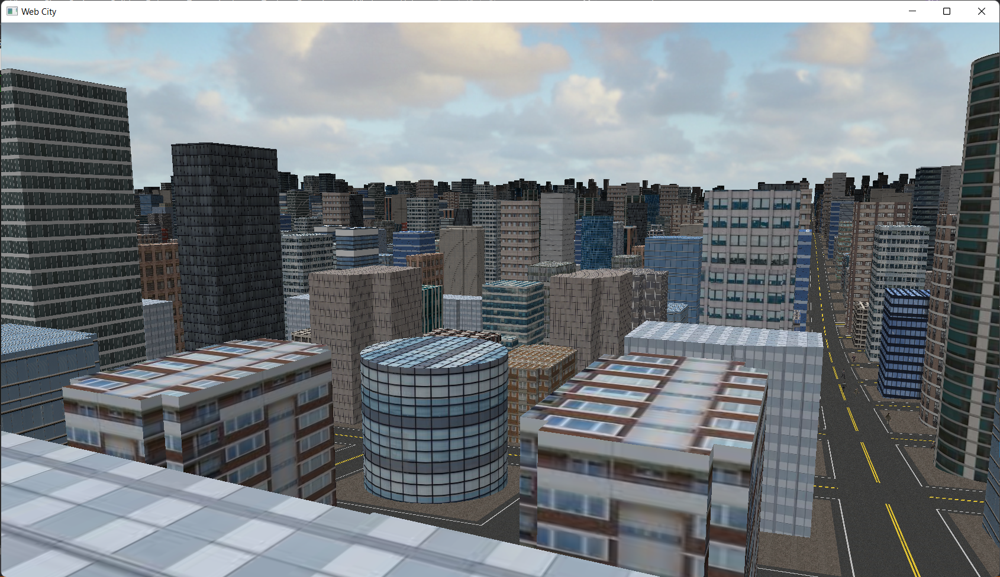
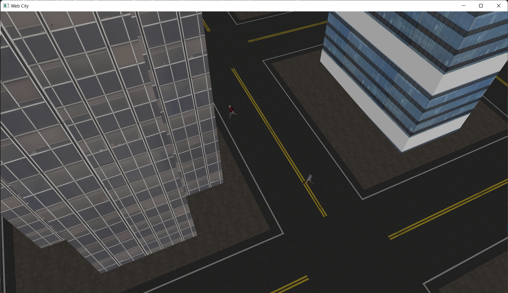

# Graphics471
CPE 471 Final Project

<html><head>
<meta http-equiv="content-type" content="text/html; charset=UTF-8">
  <title>Webpage Title</title>

  <link href="index_files/css.css" rel="stylesheet" type="text/css">

  
</head>

<body>
<section id="content">

<h1>Web City</h1>

<h4>Christopher Middleton - CSC 471 - Winter 2022 - Christian Eckhardt</h4>

<article> <!-- This adds padding at the top and bottom -->

<h3>Project Description</h3>

My Project is a first-person Spider-Man inspired video game where you
 can swing around a large city, and crash through buildings. The city is
 randomly generated upon startup and contains about ten thousand 
buildings, with people, sidewalks, and roads running throughout. There 
is also a day/night cycle, with proper lighting techniques taken into 
account in the shaders. 

<a href="https://youtu.be/ABBAyJ2aTtA">For a short video demo of the game, click here.</a>

  
  <em>View of the city sitting on top of a building</em>
     

<h3>The Buildings</h3>

There are 55 unique building obj models in this project, each with 
their own texture, and the code uses instanced rendering to draw them 
all at a reasonable speed. Because of time constraints, I did not 
implement physics detection on the buildings for the player. However, I 
did utilize a clever shader technique for finding the world location of 
clicks to shoot out webs. At the beginning of each render pass, the 
frame is cleared, and a special shader which outputs pixel distance from
 the camera within a certain radius as RGB values is run on all of the 
building instances. Then, I use an OpenGL function to read value of the 
center pixel of the screen, and convert that back to world coordinates, 
so that every frame I know exactly where in the world the cursor points.
 A drawback of this is that the floating point precision goes away when 
the renderer turns floats between 0 and 1 to integers between 0 and 256.
 This is why I had to implement the position in the shader as an offset 
from the camera instead of the actual position, because I wanted 
percision to increase with proximity to the player.

<h3>The Physics</h3>

Because I wanted the webswinging mechanics to feel as good as 
possible, I took the time to implement a real physics script for the 
game. It takes into account the heightmap, friction of the ground, and 
ensures that the player swinging around on a web would mimic the 
behavior of a 3d pendulum. Of course, with user input (WASD), you can 
nudge the player in any direction to gain momentum for some fun swings 
around the city.

<h3>The Terrain</h3>

This project also utilizes tesselation with a custom procedural 
terrain generation algorithm, which is actually deterministic. Each 
height call takes in an (x, z) pair, and finds the average distance of 
(sin(c*x), 0, sin(c*z)) to a list of 10 pre-chosen random points in 3d 
space whose values are in [-1, +1]. This gives the land a rolling hills 
feel and much smoother terrain, which is much more fit for a city. The 
land shader also takes in the three textures (sidewalk, road, and 
intersection) and determines which to use at a given point based off of a
 simple algorithm. 

<h3>The Gone, But Not Forgotten</h3>

There are two aspects of the project which I wish I would've had more
 time on to finish. Firstly, the web simply uses a draw lines call from 
open gl with an extremely basic shader, so it looks quite bad. Second, I
 really wanted to add music and ambient noise to the game to pull the 
whole experience together, but I was sadly never able to get sound 
libraries working with the visual studio project.

  
  <em>Hanging onto a building, watching over the streets at night</em>
      

Controls:
  
<ul>
    <li>WASD: Move around in the world</li>
    <li>Space: Jump while touching the ground</li>
    <li>Left Click: Shoot a web onto a nearby surface</li>
    <li>Right Click: Remove your web</li>
    <li>Scroll Wheel: Progress through day-night cycle</li>
    <li>Escape: Switch gamemodes (Webswinging, free cam, free mouse)</li>
  </ul>

<!-- A Centered image -->

  
  <em>Birds-eye view of the whole city</em>
     

<h3>Concepts Used</h3>
    <ul>
        <li>Instanced Rendering</li>
        <li>Procedural Generation</li>
        <li>Tesselation Shaders</li>
	  <li>Vertex Array Objects</li>
        <li>Lighting Effects</li>
        <li>Texturing</li>
	  <li>First-Person Movement</li>
    </ul>
</article></section>

</body></html>
